# Chuka University Voting System

A Java Swing election platform for university voting with student and admin portals, first-login OTP verification, candidacy workflows, coalition support, election lifecycle automation, and visual result analytics.

## Table of Contents

- [What This System Does](#what-this-system-does)
- [Core Features](#core-features)
- [Architecture](#architecture)
- [Project Structure](#project-structure)
- [Requirements](#requirements)
- [Quick Start (Linux)](#quick-start-linux)
- [Quick Start (Windows)](#quick-start-windows)
- [Configuration](#configuration)
- [Seeded Demo Accounts](#seeded-demo-accounts)
- [Student Screens and Flows](#student-screens-and-flows)
- [Admin Screens and Flows](#admin-screens-and-flows)
- [Database Model Summary](#database-model-summary)
- [Security and Integrity Rules](#security-and-integrity-rules)
- [Multi-User Behavior](#multi-user-behavior)
- [Troubleshooting](#troubleshooting)
- [Developer Notes](#developer-notes)
- [Recent Stability Fixes](#recent-stability-fixes)
- [Pre-Push Checklist](#pre-push-checklist)

## What This System Does

The system supports a full election cycle:

1. Students authenticate, verify OTP on first login, and change password.
2. Students can apply for candidacy (with coalition or as independent).
3. Admins review/approve/reject candidates.
4. Admins create elections, or bulk-create standard elections.
5. Students vote in active elections they are eligible for.
6. Admins and students view results (student sees final closed elections; admin sees visual analytics and exports).
7. System records audit logs for major actions.

## Core Features

- Role-based login flow (Student/Admin).
- OTP flow for first login and password reset flow.
- Candidate application + admin review workflow.
- Coalition management (create/edit/delete/import).
- Election lifecycle management (UPCOMING -> ACTIVE -> CLOSED) with auto-sync.
- Position and profile-based voting eligibility (gender/residency/faculty constraints).
- One vote per student per election-position rule.
- Admin data management with CSV import tools.
- Results dashboard with charts and PDF export.
- Auditing and CSV export for logs.

## Architecture

The app follows a layered structure:

- UI layer: Swing frames/panels for student/admin workflows.
- Service layer: business rules, validation, orchestration.
- DAO layer: SQL persistence logic.
- Model layer: domain objects (`Student`, `Election`, `Candidate`, etc.).

Key runtime components:

- `DBConnection`: singleton connection provider with reconnect-aware instance refresh.
- `AuthService`: session role routing, credential verification, OTP verification hook.
- `ElectionService`: status synchronization and election business rules.
- `VotingService`: vote validation and persistence checks.
- `AuditService`: centralized audit event recording.

## Project Structure

```
resources/
   config.properties
   db/schema.sql
src/main/
   Main.java
   dao/
   models/
   services/
   ui/
   utils/
project-images/
run.sh
docker-compose.yml
```

## Requirements

- Java JDK 17+
- MySQL 8+
- Linux path (recommended): Docker + Docker Compose
- Windows path: local MySQL + manual schema import

## Quick Start (Linux)

Linux path is automated via Docker + `run.sh`.

1. Make script executable:

```bash
chmod +x run.sh
```

2. One-command start:

```bash
./run.sh
```

This default mode performs:

- dependency checks,
- Docker DB startup,
- DB readiness wait,
- Java compilation,
- application launch.

Useful script modes:

- `./run.sh setup` -> dependency + DB only.
- `./run.sh compile` -> compile only.
- `./run.sh run` -> run app (compiles first if classes missing).

Docker DB defaults for Linux flow:

- host: `localhost`
- port: `3308`
- database: `chuka_voting_db`
- username: `root`
- password: `chuka_root_2024`

## Quick Start (Windows)

Windows flow does not use Docker and does not use `run.sh`. Docker automation is Linux-only in this project.

1. Create DB schema:

- Run `resources/db/schema.sql` in MySQL Workbench (or any MySQL client).

2. Set DB config:

- Edit `resources/config.properties`:

```properties
db.host=localhost
db.port=3306
db.name=chuka_voting_db
db.user=root
db.password=your_password
```

3. VS Code one-click build (recommended):

- Run Task -> `Windows: Compile + Copy Resources`

4. Manual compile alternative:

```powershell
mkdir out\vscode-bin
dir /s /b src\*.java > sources.txt
javac -cp "lib/*" -d out\vscode-bin @sources.txt
del sources.txt
xcopy /e /i /y resources out\vscode-bin
```

5. Run:

```powershell
java -cp "out\vscode-bin;lib/*" main.Main
```

IDE note:

- Ensure `resources/` is on runtime classpath so `config.properties` is discoverable.

## Configuration

DB resolution order in `DBConfig`:

1. Environment variables (`DB_HOST`, `DB_PORT`, `DB_NAME`, `DB_USER`, `DB_PASSWORD`)
2. `resources/config.properties`
3. hardcoded defaults

This lets Linux/Docker and Windows/local workflows coexist cleanly.

## Seeded Demo Accounts

From `resources/db/schema.sql` seed data:

- Admin:
   - Email: `admin@chuka.ac.ke`
   - Password: `Student@123`

- Multiple student records are pre-seeded.
   - Initial Password: `Student@123`

Important first-login behavior:

- Student first login requires OTP verification and then forced password change.

## Student Screens and Flows

### Student Dashboard

Shows profile summary, active-election countdown cards, and quick actions.

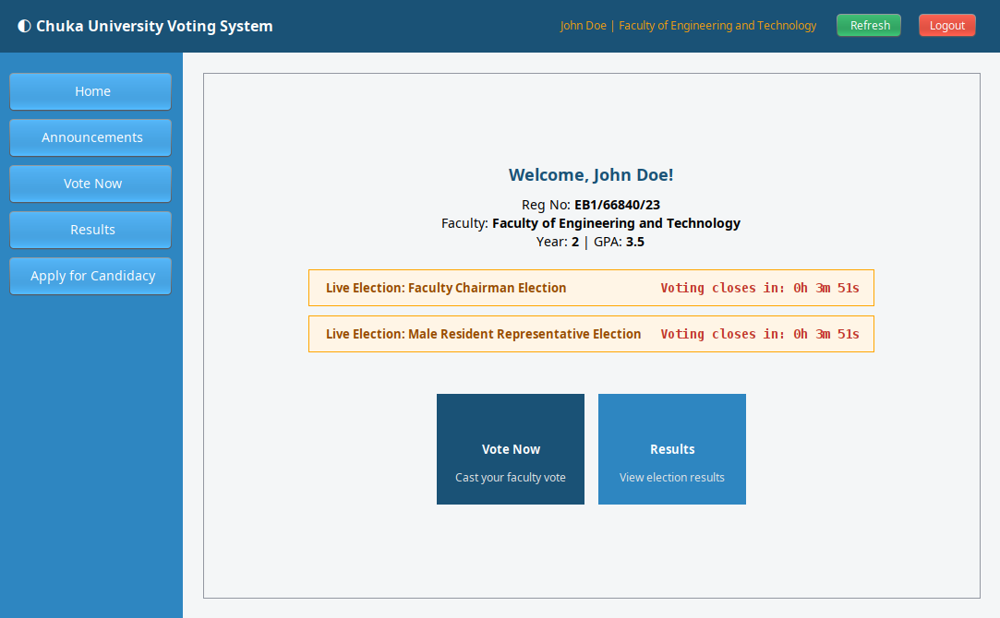

### Student Announcements

Displays active announcements and live election update cards.

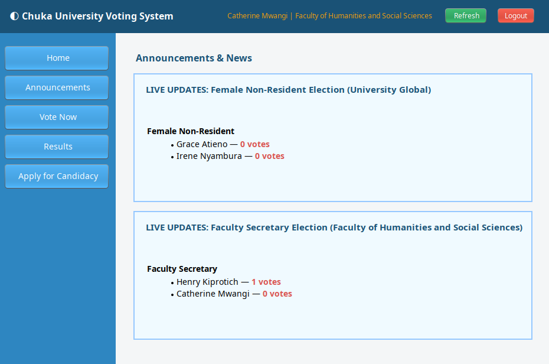

### Student Voting Panel

Lists eligible active elections and candidate cards by position. Includes vote confirmation and duplicate-vote prevention.

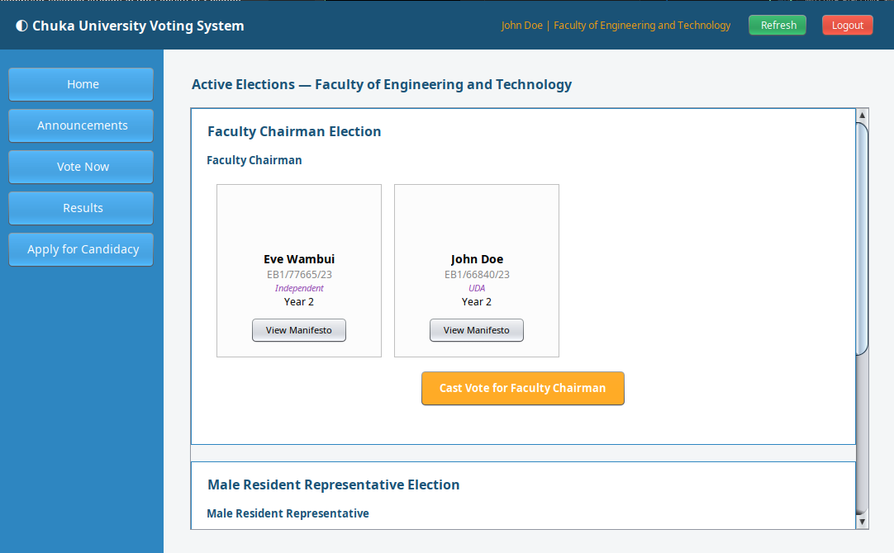

### Student Results Panel

Shows closed election standings by position.

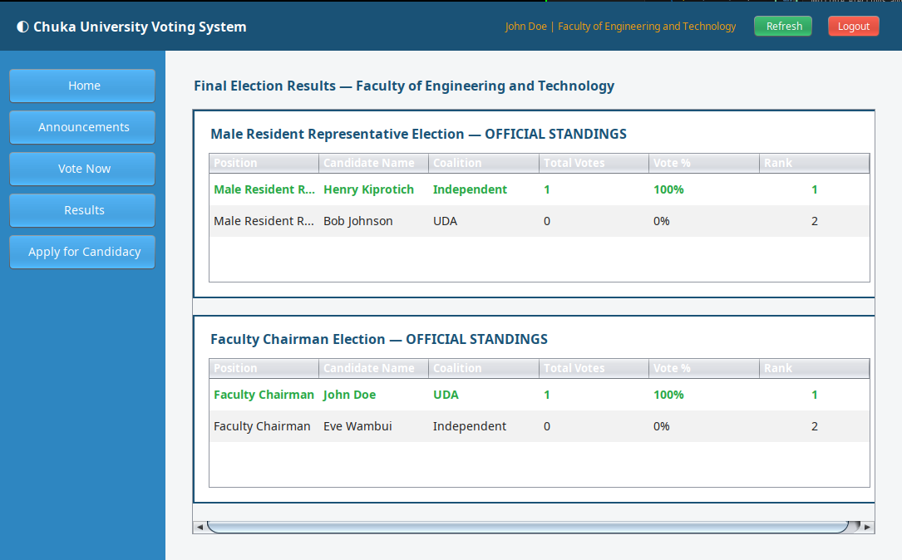

### Apply for Candidacy

Student submits candidacy with manifesto and coalition selection (or independent).

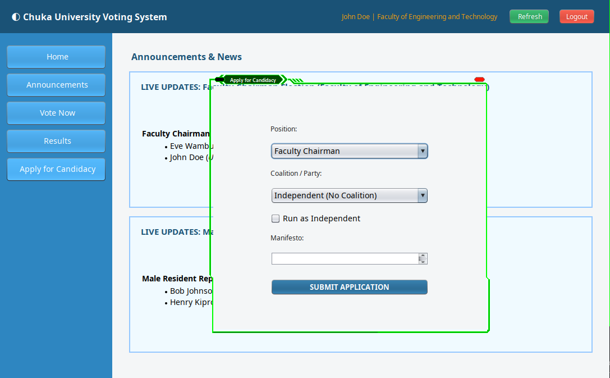

## Admin Screens and Flows

### Admin Dashboard

Home cards for all admin modules and top-bar notifications.

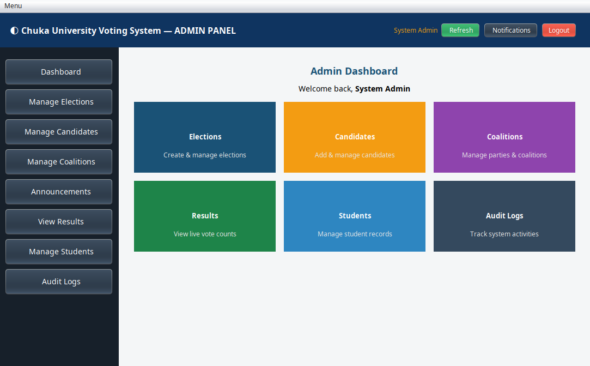

### Manage Elections

Create/edit/delete elections, bulk import elections, and bulk-create standard election pack.

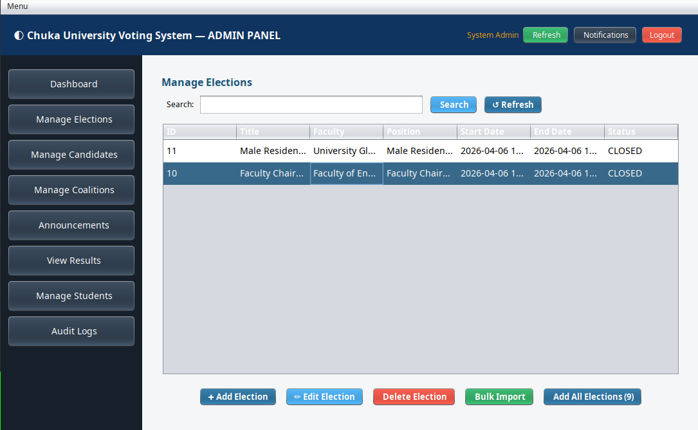

### Manage Candidates

Review candidate applications, approve/remove candidates, edit candidate details, and CSV import.

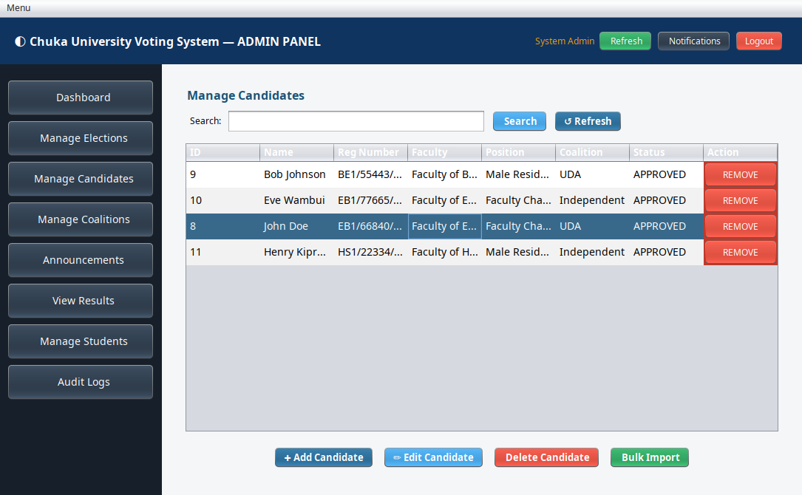

### Manage Coalitions

Create/edit/delete coalitions and bulk import from CSV.

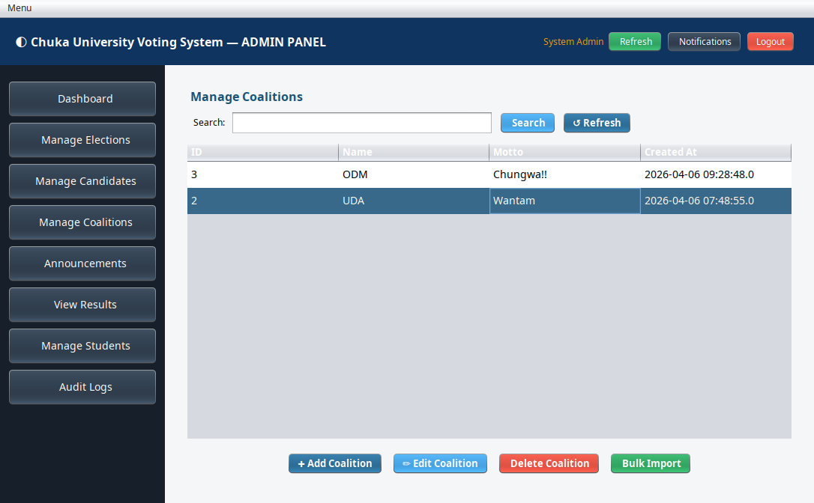

### Manage Announcements

Create, search, delete, and clear announcements.

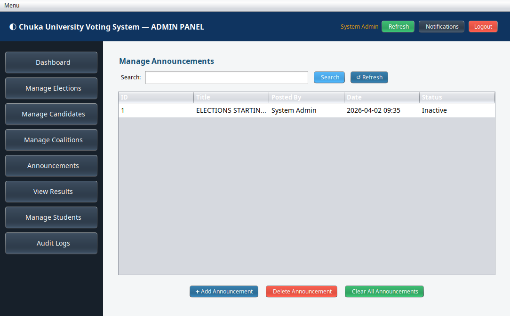

### Manage Students

CRUD-style management with CSV import and account deactivation.

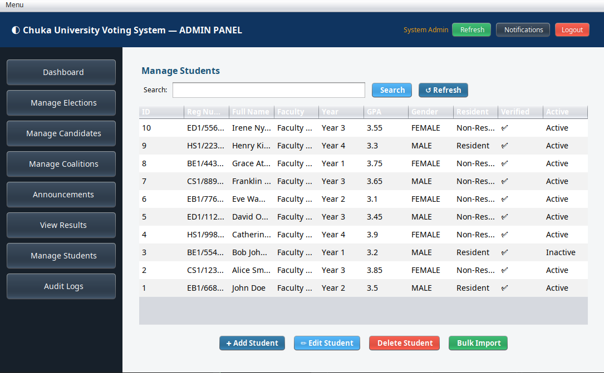

### Audit Logs

Filter by date/search and export CSV.

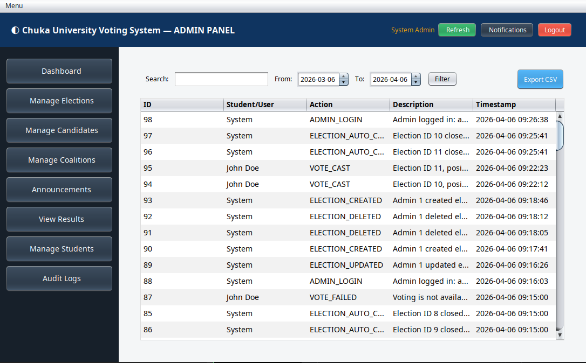

### Results Analytics

Election turnout analytics, position charts, and PDF export.

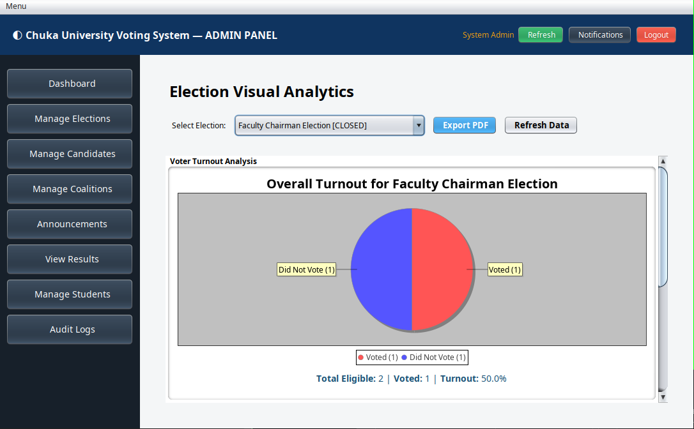

## Database Model Summary

Primary tables:

- `students`, `admins`, `faculties`, `positions`
- `candidate_applications`, `coalitions`, `nominations`
- `elections`, `election_candidates`, `votes`
- `announcements`, `admin_notifications`
- `otp_logs`, `audit_logs`

Important constraints:

- `votes`: unique `(student_id, election_id, position_id)` to enforce one vote per position.
- `candidate_applications`: unique `(student_id, position_id)`.
- coalition FK set null on coalition delete to preserve candidate rows.

## Security and Integrity Rules

- Passwords are SHA-256 + per-user salt.
- OTP entries expire and track failed attempts.
- Election/position/profile checks run before vote insert.
- Audit events are written for major auth, candidate, and election actions.

## Multi-User Behavior

- The system supports many users concurrently across different running app instances/devices, backed by shared MySQL state.
- Each running desktop process maintains a single active in-memory session context for that process.

## Troubleshooting

### 1) App says database connection failed

Symptoms:

- startup dialog from `Main` with MySQL connection error.

Fix:

1. Verify DB is running.
2. Verify host/port/user/password in env vars or `resources/config.properties`.
3. Verify schema was imported (`resources/db/schema.sql`).
4. If on Linux Docker flow, run:

```bash
docker compose ps
docker compose logs db
```

### 2) Port 3308 already in use (Linux)

Fix:

1. Stop conflicting service or change mapping in `docker-compose.yml`.
2. Re-run `./run.sh setup`.

### 3) `docker compose` / `docker-compose` not found

Fix:

- Install Docker + Compose plugin.
- Confirm with:

```bash
docker compose version
```

### 4) MySQL JDBC driver not found

Fix:

- Ensure connector JAR exists under `lib/` and classpath includes `lib/*`.

### 5) OTP not received

Expected behavior in this build:

- OTP delivery is simulation-first. Check terminal output for generated OTP under SMS simulation logs.

### 6) Election creation fails with "No approved candidates"

Cause:

- Election creation enforces approved candidate availability for target position/faculty.

Fix:

1. Approve at least one candidate for that position.
2. Retry election creation.

### 7) Candidate approved but not in expected election

Cause:

- Candidate binding follows position/faculty eligibility rules and election status sync.

Fix:

1. Confirm candidate position matches election position.
2. Confirm election scope (faculty/global) matches candidate profile.
3. Refresh election statuses and candidate list in admin UI.

### 8) Build works in terminal but VS Code fails to find config/resources (Windows)

Symptoms:

- App runs from terminal but fails from VS Code Run/Debug with missing `config.properties` or resource stream errors.

Fix (recommended for VS Code):

1. Ensure Java project settings use this workspace layout in `.vscode/settings.json`:

```json
{
   "java.project.sourcePaths": ["src"],
   "java.project.outputPath": "out/vscode-bin",
   "java.project.referencedLibraries": ["lib/**/*.jar"]
}
```

2. Add a launch profile that includes `resources/` on classpath in `.vscode/launch.json`:

```json
{
   "version": "0.2.0",
   "configurations": [
      {
         "type": "java",
         "name": "Run Main (with resources)",
         "request": "launch",
         "mainClass": "main.Main",
         "cwd": "${workspaceFolder}",
         "classPaths": ["$Auto", "${workspaceFolder}/resources"]
      }
   ]
}
```

3. Run using the `Run Main (with resources)` profile.

4. You can also run VS Code Task -> `Windows: Compile + Copy Resources` before debugging.

Fallback (copy resources into build output like terminal flow):

```powershell
xcopy /e /i /y resources out\vscode-bin
```

## Developer Notes

Helpful commands:

```bash
# Linux Docker lifecycle
docker compose up -d
docker compose logs -f db
docker compose down

# Compile only
./run.sh compile

# Setup only (dependencies + DB)
./run.sh setup
```

## Recent Stability Fixes

The latest hardening pass included:

- fixed admin PDF turnout to use real distinct voter turnout input,
- fixed vote confirmation email to use readable position name,
- prevented coalition DAO from closing shared singleton DB connection on each operation,
- added announcement create validation to block empty title/body posts,
- improved dashboard lifecycle cleanup to reduce timer/session leaks during refresh/logout.

## Pre-Push Checklist

- `./run.sh compile` succeeds.
- Linux flow runs with `./run.sh`.
- Windows flow verified with local MySQL + `config.properties`.
- All `project-images/*.png` render in README on GitHub.
- Admin and student critical paths smoke-tested.
- No unresolved merge conflicts or accidental secrets in repo.

## License

MIT License.
